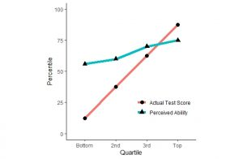
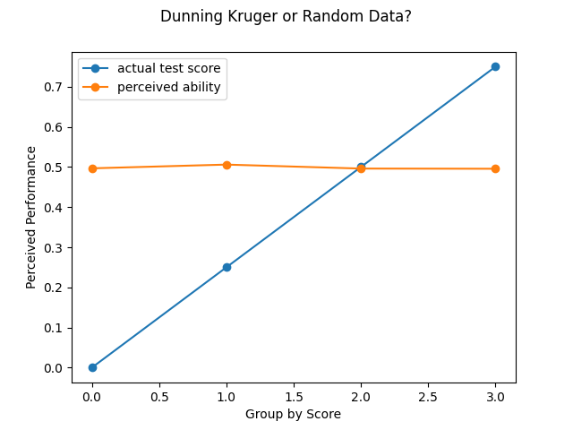
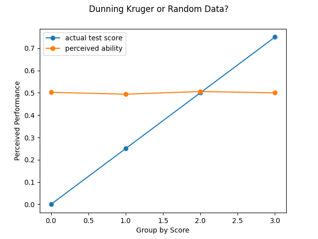
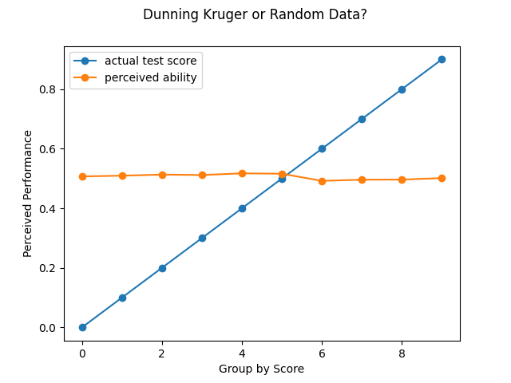

# Dunning-Kruger is Wrong!

Holy shit people, I can't believe it, but it appears that the original Dunning-Kruger experiment does not actually prove the effect exists as people believe!

Full details in this article:
https://www.mcgill.ca/oss/article/critical-thinking/dunning-kruger-effect-probably-not-real

To summarize, a cognitive bias can't be demonstrated by an experiment which also shows the same results with random data.  If human biases were really the cause, then you shouldn't observe the effect from purely random data.

Upon hearing this, I couldn't believe it.  The Dunning-Kruger effect makes so
much sense, and seems so obvious - coupled with the fact that there were
experiments that seemed to observe it and it seemed to have survived
considerable scientitic scrutiny.

The above article calls all of that into question.  To convince myself the article has a valid claim, and since not too many details were given, I decided to try to replicate the claims and produce random data and observe the Dunning-Kruger effect myself.  Furthermore, if I could create a simple, easy-to-understand Python script that anyone could run and see the results for themselves, that seems like a good use of my time!

# Additional Research:

## https://www.openpsych.net/files/papers/Kirkegaard_2021c.pdf

This recent (2021) study failed to find evidence for DK across a wide variety of online test takers (n=2413)

## https://psychology.stackexchange.com/a/26553

Question answerer cites many studies and notes that all suffer from similar claims of analysis artifacts, calling the results into question.

## https://skepchick.org/2020/10/the-dunning-kruger-effect-misunderstood-misrepresented-overused-and-non-existent/

Skepchick has a complete (and fascinating) writeup about it

# Original Dunning-Kruger Results

# Results

Pretty much every time you run this thing, it produces a graph that looks *identical* to the graph from the original study.

Like, say, this:

Or this:

You might imagine four groups isn't *that* many...what if we tried more groups?  NOPE, still the same results:

